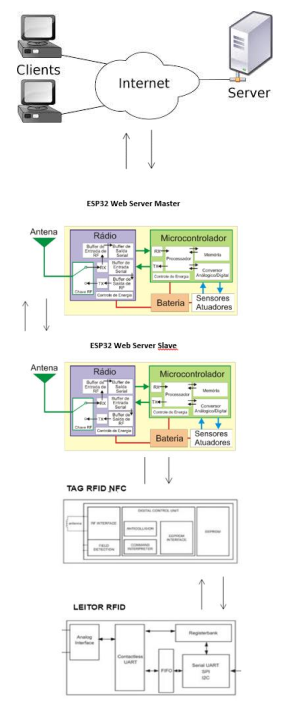
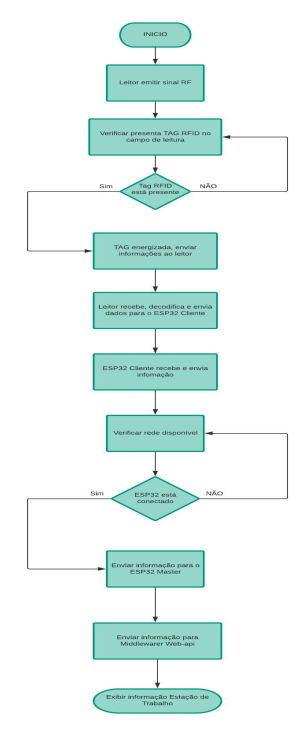
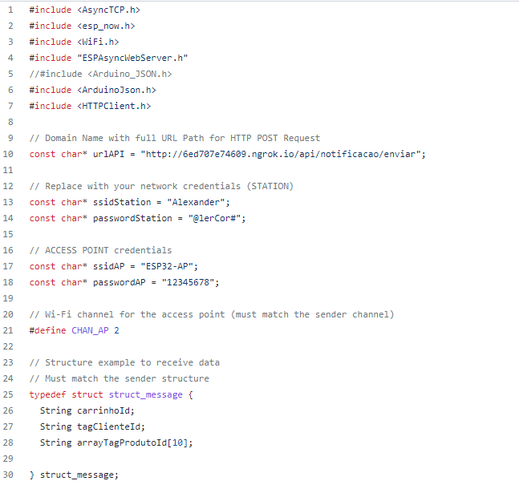
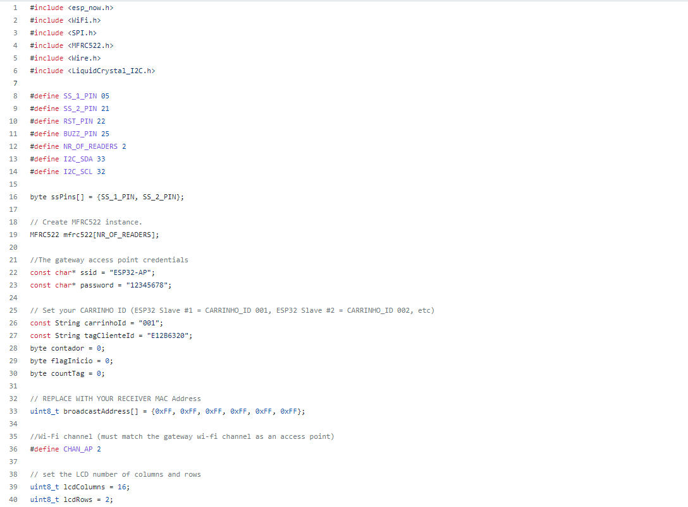
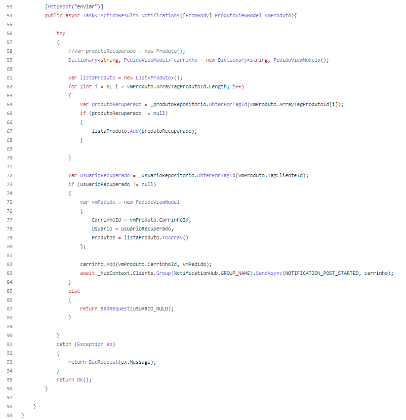

# Operações

Tendo em vista o tempo empregado no registro de itens, o protótipo em questão tem como objetivo diminuir o tempo gasto no processo de compras, através da descentralização do processo de registro de itens nos caixas que é a parte mais demorada da compra, provocando descontentamento dos clientes e, consequentemente, perda de fidelidade, sendo assim, otimizar o processo, listar e somar os produtos adicionados pelo consumidor antes de chegarem ao caixa. Finalmente, apresentar o resultado processado em um dispositivo de saída, ressaltando que o sistema apresentado visa ser acoplável ao sistema existente na organização.

_Funcionamento:_

Considerando o cliente afiliado a loja, ele utiliza do cartão de identificação para logar no sistema e a medida que os produtos são colocados nas cestas ou carrinhos, são coletados através dos sensores RFID, adicionados em uma lista e enviados por meio de requisação HTTP para WEB.API que é consumida pela aplicação front-end.

## Diagrama de bloco

_Imagem:_

## Fluxograma

_Imagem:_

## Código Fonte

_Fonte: [Sistema embarcado SmartStore.IoT](https://github.com/AlexanderVieira/SmartStore.IoT#readme)_

_Master:_

_Slave:_

_Fonte: [Web-API](https://github.com/AlexanderVieira/SmartStoreASPNETCoreWebApi#readme)_

_Controller:_
