## **Sobre os datasets**
- ### **Conjunto de dados de clientes**

Este conjunto de dados contém informações sobre o cliente e sua localização. Use-o para identificar clientes únicos no conjunto de dados de pedidos e para encontrar o local de entrega dos pedidos.

Em nosso sistema, cada pedido é atribuído a um ID de cliente único . Isso significa que o mesmo cliente obterá IDs diferentes para pedidos diferentes. O objetivo de ter um unique_id do cliente no conjunto de dados é permitir que você identifique os clientes que fizeram recompras na loja. Caso contrário, você descobrirá que cada pedido tem um cliente diferente associado.

_Fonte: [imagem dos dados olist_customers_dataset.csv](https://www.kaggle.com/code/anshumoudgil/olist-ecommerce-analytics-quasi-poisson-poly-regs/data?select=olist_customers_dataset.csv)_

_imagem dos dados olist_customers_dataset.csv_

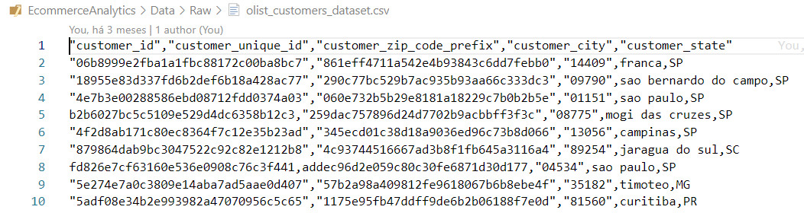

- ### **Conjunto de dados de geolocalização**

Este conjunto de dados contém informações dos CEPs brasileiros e suas coordenadas lat / lng. Use-o para traçar mapas e encontrar distâncias entre vendedores e clientes.

_Fonte: [imagem dos dados olist_geolocation_dataset.csv](https://www.kaggle.com/code/anshumoudgil/olist-ecommerce-analytics-quasi-poisson-poly-regs/data?select=olist_geolocation_dataset.csv)_

_imagem dos dados olist_geolocation_dataset.csv_

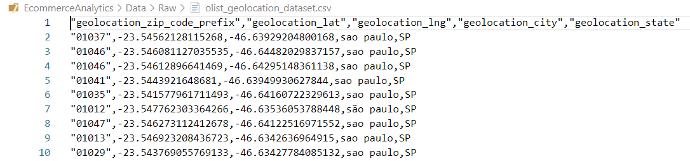

- ### **Conjunto de dados de itens do pedido**

Este conjunto de dados inclui dados sobre os itens adquiridos em cada pedido.

Exemplo:

O order_id = 00143d0f86d6fbd9f9b38ab440ac16f5tem 3 itens (mesmo produto). Cada item tem o frete calculado de acordo com suas medidas e peso. Para obter o valor total do frete de cada pedido, basta somar.

O valor total do item_de_pedido é: 21.33 * 3 = 63.99

O valor total do frete é: 15.10 * 3 = 45.30

O valor total do pedido (produto + frete) é: 45.30 + 63.99 = 109.29

_Fonte: [imagem dos dados olist_order_items_dataset.csv](https://www.kaggle.com/code/anshumoudgil/olist-ecommerce-analytics-quasi-poisson-poly-regs/data?select=olist_order_items_dataset.csv)_

_imagem dos dados olist_order_items_dataset.csv_

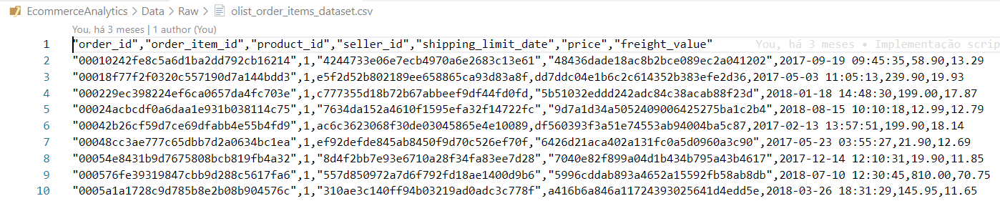

- ### **Conjunto de dados de pagamentos**

Este conjunto de dados inclui dados sobre as opções de pagamento de pedidos.

_Fonte: [imagem dos dados olist_order_payments_dataset.csv](https://www.kaggle.com/code/anshumoudgil/olist-ecommerce-analytics-quasi-poisson-poly-regs/data?select=olist_order_payments_dataset.csv)_

_imagem dos dados olist_order_payments_dataset.csv_

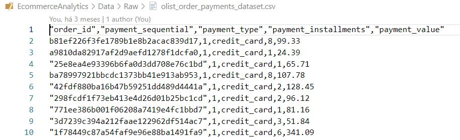

- ### **Conjunto de dados de avaliações de pedidos**

Este conjunto de dados inclui dados sobre as avaliações feitas pelos clientes.

Depois que um cliente compra o produto na Olist Store, um vendedor é notificado para atender a esse pedido. Assim que o cliente recebe o produto, ou quando vence a previsão de entrega, o cliente recebe por e-mail uma pesquisa de satisfação onde pode dar um apontamento sobre a experiência de compra e anotar alguns comentários.

_Fonte: [imagem dos dados olist_order_reviews_dataset.csv](https://www.kaggle.com/code/anshumoudgil/olist-ecommerce-analytics-quasi-poisson-poly-regs/data?select=olist_order_reviews_dataset.csv)_

_imagem dos dados olist_order_reviews_dataset.csv_

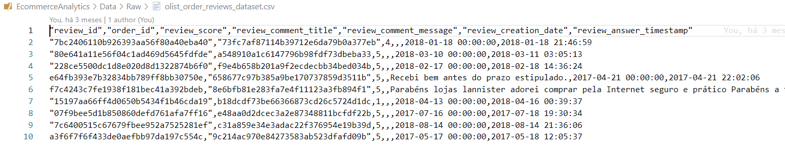

- ### **Conjunto de dados do pedido**

Este é o conjunto de dados principal. Em cada pedido, você pode encontrar todas as outras informações.

_Fonte: [imagem dos dados olist_orders_dataset.csv](https://www.kaggle.com/code/anshumoudgil/olist-ecommerce-analytics-quasi-poisson-poly-regs/data?select=olist_orders_dataset.csv)_

_imagem dos dados olist_orders_dataset.csv_

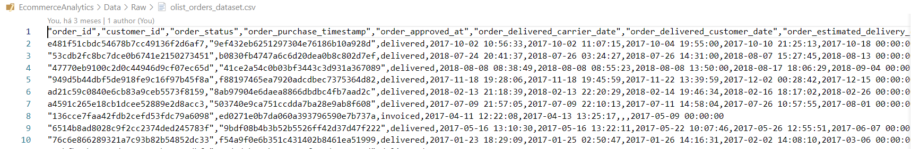

- ### **Conjunto de dados de produtos**

Este conjunto de dados inclui dados sobre os produtos vendidos pela Olist.

_Fonte: [imagem dos dados olist_products_dataset.csv](https://www.kaggle.com/code/anshumoudgil/olist-ecommerce-analytics-quasi-poisson-poly-regs/data?select=olist_products_dataset.csv)_

_imagem dos dados olist_products_dataset.csv_

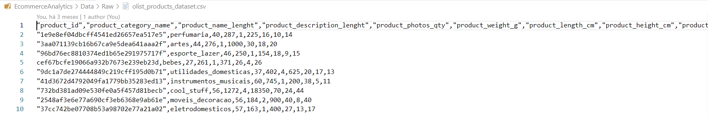

- ### **Conjunto de dados de vendedores**

Este conjunto de dados inclui dados sobre os vendedores que atenderam aos pedidos feitos na Olist. Use-o para encontrar a localização do vendedor e para identificar qual vendedor atendeu a cada produto.

_Fonte: [imagem dos dados olist_sellers_dataset.csv](https://www.kaggle.com/code/anshumoudgil/olist-ecommerce-analytics-quasi-poisson-poly-regs/data?select=olist_sellers_dataset.csv)_

_imagem dos dados olist_sellers_dataset.csv_

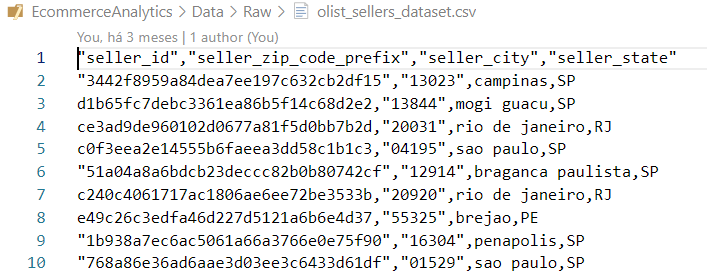

- ### **Tradução do nome da categoria**
Traduz o nome da categoria do produto para o inglês.

_Fonte: [imagem dos dados product_category_name_translation.csv](https://www.kaggle.com/code/anshumoudgil/olist-ecommerce-analytics-quasi-poisson-poly-regs/data?select=product_category_name_translation.csv)_

_imagem dos dados product_category_name_translation.csv_

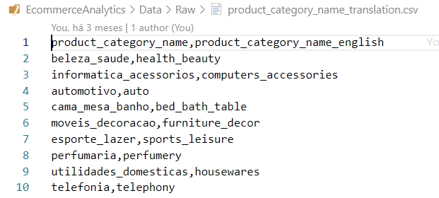

- ### **Dase de dados do MSSQL SERVER**

_Exemplo: imagem do esquema de dados do sql server_

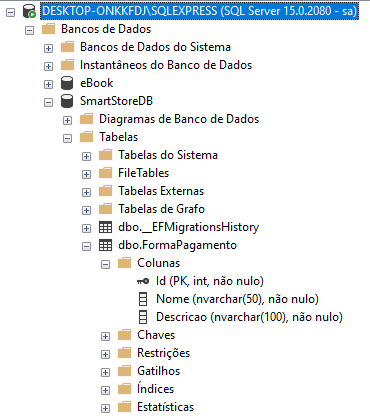
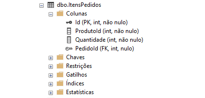
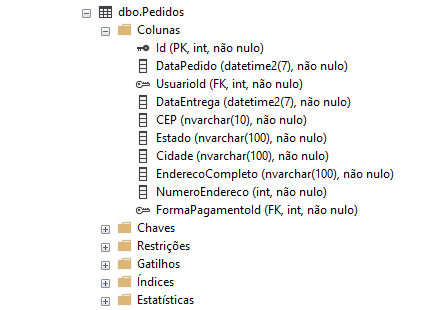
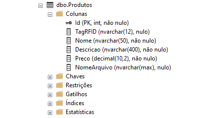
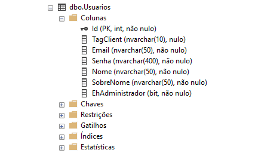
